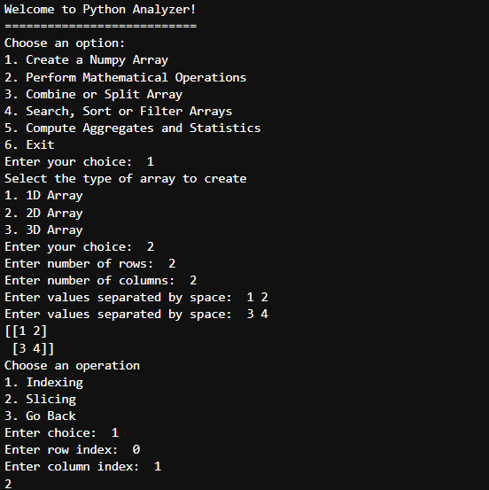
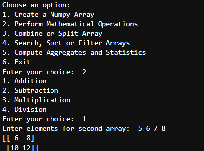
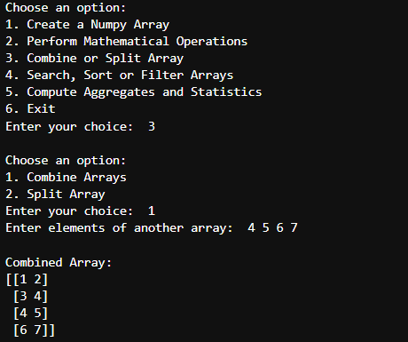

# 📊 Python NumPy Data Analyzer

A simple **command-line data analysis tool** built using **Python and NumPy**.  
This project allows users to create arrays, perform mathematical operations, combine or split arrays, search or filter arrays, and compute statistical values.

The program works through an **interactive menu system** where users choose the operation they want to perform.

---

## 🚀 Features

✨ Create different types of arrays
- 1D Array
- 2D Array
- 3D Array

🧮 Perform mathematical operations
- Addition
- Subtraction
- Multiplication
- Division

🔗 Combine or Split Arrays

🔎 Search, Sort, and Filter Arrays

📈 Compute aggregates and statistics
- Sum
- Mean
- Maximum
- Minimum

---

## 🛠 Technologies Used

- 🐍 Python
- 🔢 NumPy
- 💻 Command Line Interface

---

## 📂 Project Structure

```

Project8
│
├── Project8.ipynb
├── README.md
│
└── Screenshots
├── s1.png
├── s2.png
└── s3.png

```

---

## 📸 Screenshots

### 🖥 Main Menu and Array Creation


---

### ➕ Mathematical Operations


---

### 🔗 Combine Arrays


---

## ⚙️ How to Run the Project

1. Install NumPy

```

pip install numpy

```

2. Run the notebook

```

jupyter notebook

```

3. Open `Project8.ipynb` and run all cells.

---

## 🎯 Learning Objectives

This project helps in understanding:

- NumPy array creation
- Indexing and slicing
- Mathematical operations on arrays
- Combining and splitting arrays
- Basic statistical calculations

---

## 👨‍💻 Author

Devan Patel  
Python & Data Analysis Learner 🚀
```

